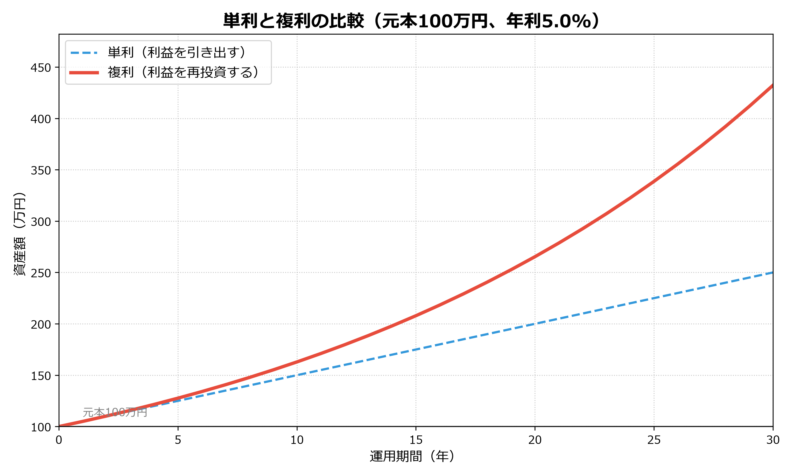

# 【図解】中学生からわかる資産運用 〜お弁当メタファーで学ぶ投資と自衛〜

## 第1回：投資って怖い？「水」と「魔法の雪だるま」の話

> この記事は、**中学生から大人まで誰でも**、全4回で資産運用の基本から詐欺の見抜き方までを楽しく学ぶシリーズの第1回です。

**【目次：中学生からわかる資産運用シリーズ】**
*   **▶ 現在地：第1回：【準備編】投資って怖い？「水」と「魔法の雪だるま」の話**
*   第2回：[【用語編】専門用語は「お弁当」に置き換えよう！](#)
*   第3回：[【実践編】誰でもできる王道の食べ方（長期・積立・分散）](#)
*   第4回：[【防衛・卒業編】毒入り弁当（詐欺）の見抜き方と卒業クイズ](#)

---

## 投資って、なんだか怪しいと思ってない？

もしかするとあなたは、資産運用や投資って難しそうだし、損しそうで怖い、と思うかもしれません。正直、ただのギャンブルなんじゃないの？って思っている人も多いはずです。

その気持ち、すごくよくわかります。大金が絡む話ですし、よくわからないものには手を出したくないですよね。でも、実は資産運用って知っているだけで人生のボーナスステージに乗れる、とってもお得で美味しい仕組みなんですよ。今回はまず、この「仕組み」の入り口をお話ししたいと思います。

## なぜ投資で利益が出るの？

「そもそも、なんで投資なんかでお金が増えるの？ 誰かが損をしている裏で儲けているだけじゃないの？」と思うかもしれません。

実は、投資の本質は「誰かとの奪い合い」ではありません。**「世界経済の成長という『上りのエスカレーター』に乗ること」** なのです。

人類の歴史を振り返ると、私たちは「誰かが得意なこと（専門化）」を「別の誰かと交換（分業）」することで、常に新しい技術や豊かさを生み出し続けてきました[^1]。

世界中の企業や人々が「もっと便利な世の中にしたい」「もっと豊かな暮らしがしたい」と日々努力し、イノベーションを起こし続けている限り、世界の経済は（一時的な不景気はあっても）長期的な視点で見れば右肩上がりで成長し続けると予測されています。

投資とは、この **「世界中の人々の『明日を良くしたい』という営み」に自分のお金を託し、その成長の果実を分けてもらうシステム**なのです。だからこそ、ギャンブルとは全く違う合理的な仕組みだと言えます。

## 安全なはずの「水」が蒸発する？（インフレリスク）

とはいえ、投資が怖いなら、銀行に貯金しておけば一番安全だと思っていませんか？ 実は、投資の世界では、銀行の預金（現金）のことを **「水」** に例えたりします。生きていくのに絶対必要だけど、そのまま置いておいても増えたり成長したりはしないからです。

「増えなくても、減らないならそれでいい！」と思うかもしれません。でも、それがそうとも言い切れないんです。ちょっと想像してみてください。10年前、100円で買えたジュースが、今は130円になったりしていませんか？ これを **インフレ（物価上昇）** と呼びます。

モノの値段が上がるということは、裏を返せば「お金の価値が下がっている」ということなんです。銀行に預けている100万円の数字自体は減りませんが、買えるモノの量は確実に減っていきます。つまり、安全だと思っていた「水（預金）」は、放っておくと少しずつ蒸発してしまうんです。

## でも投資の前に、まずは「絶対に使わない水」を確保しよう！

とはいえ、だからといって全額を投資に回すのは絶対にやめてくださいね！ 資産運用を始める前に一番大切なのは、 **「生活防衛資金」** という名の「絶対に手をつけてはいけない水（預金）」をしっかりバケツに確保しておくことです。

病気やケガ、急な引っ越しなど、人生には思いがけない出費がつきものです。そんな時、もし全額を投資に回していて、たまたまそのタイミングで投資の成績が下がっていたら、大損してしまいますよね。だからこそ、まずは「何かあっても数ヶ月〜半年は暮らせる現金」をしっかり確保しておく。これが最大の防御力（リスク管理）になります。

👇 年代別のライフイベントと必要資金の目安を見る（クリックで開きます）

人生にはいろいろなお金がかかるタイミング（ライフイベント）があります。自分がこれからどんな人生を歩みたいか（ライフプランニング）を少しだけ想像してみましょう！

*   **20代〜30代（就職・結婚・子育てのスタート）**
    *   結婚費用：約300万円〜
    *   出産・育児：数10万円〜
    *   引っ越し：約30万円〜50万円（敷金・家具家電・引越し代など）
    *   車の購入：約100万円〜300万円（中古車〜新車）
    *   **アドバイス**：まずは給料の数ヶ月分（生活費の3〜6ヶ月分）を「生活防衛資金」として銀行口座に確保しましょう！
*   **40代〜50代（教育・住宅）**
    *   養育資金（大学卒業まで）：一人あたり約1,000万〜2,000万円
    *   住宅購入（頭金など）：数百万円〜
*   **60代以降（老後・セカンドライフ）**
    *   老後の生活費：年金にプラスして必要な額（一般的に数千万円と言われることも）

※これらはあくまで目安です。自分のペースに合わせて、少しずつ準備していくことが大切です。

## 利益が利益を生む「魔法の雪だるま」（複利の力）

さて、生活防衛資金という「水」をしっかり確保できたら、いよいよ余ったお金で資産運用を始めましょう。ここで知ってほしいのが、あの天才物理学者アインシュタインが「人類最大の発見」と呼んだ **複利（ふくり）** という魔法の力です。

投資で利益が出たとき、その利益をどう扱うかで **「単利（たんり）」** と **「複利」** の2つの方法に分かれます。

まずは「単利」。たとえば、100万円（元本）を投資して、毎年5万円の利益（リターン）が出たとします。単利は、この5万円を毎回引き出してお小遣いにしてしまう方法です。次の年も100万円のまま投資するので、もらえる利益はずっと5万円のまま。雪だるまの大きさはいつまでたっても変わりません。

一方で「複利」は、この5万円を引き出さずに、そのまま元本に足して105万円として次の年も投資に回すんです。すると、今度は105万円に対して5万2500円の利益がつきます。これを繰り返していくと、**利益が新しい利益を生み出し、まるで雪山を転がる雪だるまのように、資産が爆発的に大きくなっていくんです**。

これを数式で表すとこうなります。

$$
A = P(1+r)^t
$$

*   $A$ = 将来の資産の大きさ
*   $P$ = 最初の資金（元本）
*   $r$ = 利率（リターン）
*   $t$ = **時間（年数）**

数学の授業みたいですが、難しく考えなくて大丈夫です。一番注目してほしいのは、複利の式では **$t$（時間）が右上の小さな文字（指数）になっている** こと。単なる足し算ではなく指数関数になるため、時間が経てば経つほど、グラフのカーブがギュン！と上に向かって跳ね上がるんです。

資産運用では、この「複利」のシステムに乗っかって、**できるだけ長い時間（ $t$ ）を味方につけることが、勝つための絶対ルール**なんです。

## まとめ：投資は「時間」を味方につけるシステム

安全だと思っていた「水」はインフレで目減りする可能性がある一方で、投資は「複利」の力で雪だるま式に増える可能性があることがわかっていただけたかと思います。

投資は決してギャンブルではなく、**資本主義の仕組みに乗っかって、時間をかけて資産を育てていくための合理的なシステム**なんです。

さて、次回は「じゃあ具体的に何を買えばいいの？」というお話をします。難しい専門用語はナシ、みんなが大好きな **「お弁当」** に置き換えて解説するので、楽しみにしていてくださいね！

---

*   ▶ [第2回：【用語編】専門用語は「お弁当」に置き換えよう！](#)
*   ▶ [今すぐゲームでシミュレーションしてみる！（遊んでわかる資産運用！）](#)

> **【免責事項】**
> 本記事およびゲームのシミュレーションは、実践的な金融経済知識の普及啓発を目的として作成したものであり、特定の商品の売買の勧誘を目的としたものではありません。金融商品を購入する際は、商品の特性や取引の仕組み、リスクや手数料等の費用などを十分にご理解いただいた上、必ずご自身の判断と責任において実行してください。

## 参考文献
[^1]: マット・リドレー (2010) 『繁栄――明日を切り拓くための人類10万年史』（大田直子ほか訳）, 早川書房, pp.22-25.