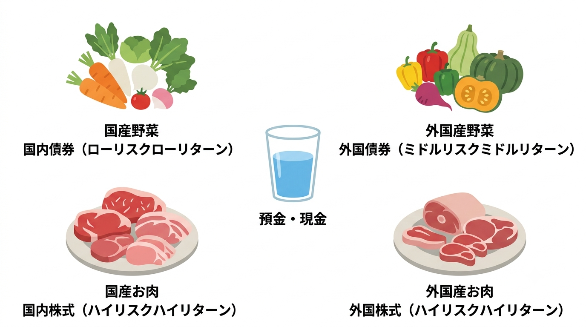
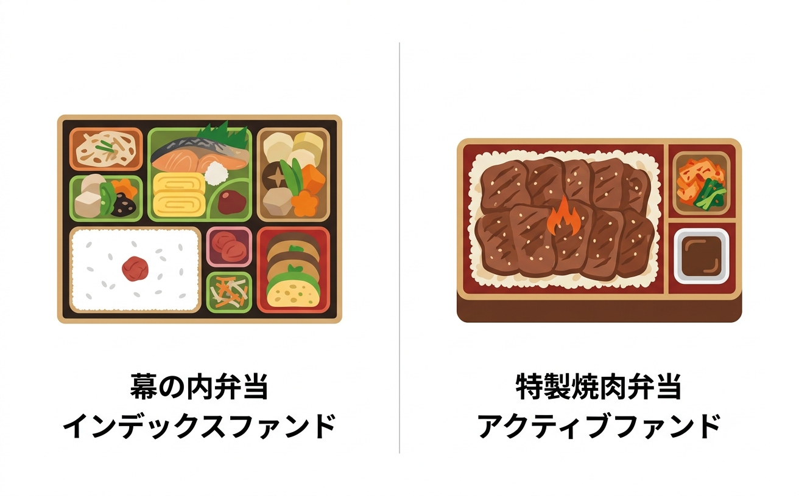
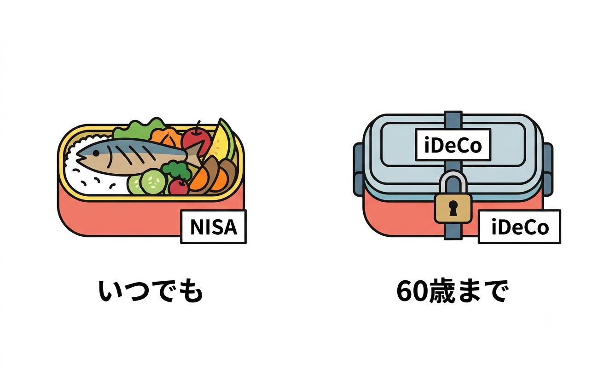

# 【図解】中学生からわかる資産運用 〜お弁当メタファーで学ぶ投資と自衛〜

## 第2回：専門用語は「お弁当」に置き換えよう！

> この記事は、**中学生から大人まで誰でも**、全4回で資産運用の基本から詐欺の見抜き方までを楽しく学ぶシリーズの第2回です。

**【目次：中学生からわかる資産運用シリーズ】**
*   [第1回：【準備編】投資って怖い？「水」と「魔法の雪だるま」の話](https://qiita.com/あなたの記事URL1)
*   **▶ 現在地：第2回：【用語編】専門用語は「お弁当」に置き換えよう！**
*   [第3回：【実践編】誰でもできる王道の食べ方（長期・積立・分散）](https://qiita.com/あなたの記事URL3)
*   [第4回：【防衛・卒業編】毒入り弁当（詐欺）の見抜き方と卒業クイズ](https://qiita.com/あなたの記事URL4)

---

## 専門用語ばかりで、日本語を話して！と思ってない？

前回は、投資はギャンブルではなく、**「時間」と「複利（雪だるま）」を味方につけて資産を育てる合理的なシステム**だというお話をしました。

もしかするとあなたは、「よし、やってみよう！」と思ったものの、いざ調べ始めると……「ファンド？ インデックス？ NISA？ 専門用語ばかりで意味がわからない！ 日本語を話して！」と絶望しているかもしれませんね。

その気持ち、痛いほどわかります。金融の用語って、わざと難しくしているんじゃないかと思うくらい漢字やカタカナが多いですよね。

でも安心してください。今日出てくる難しそうな言葉は、すべて **「お弁当屋さん」での買い物**に置き換えて説明します。

結論から言うと、**資産運用はたった「3つの階層」でできています**。

## レイヤー1：まずは「基本の5大食材」を知ろう

スーパーに買い物に行くと、お肉や野菜などいろんな「食材」がありますよね。投資の世界の最も基本となるパーツ（部品）は、大きく分けて2つの食材しかありません。

一つ目は **「株（かぶ / 株式）」** 。これは言ってみれば **「お肉」** です。
食べればものすごいエネルギー（高いリターン）になりますが、毎日こればかり食べていると胃もたれ（価格の振れ幅＝リスク）してしまいます。お肉の値段は毎日変動し、これを **「株価（かぶか）」** と呼びます。持っていると、おまけで **「配当金（はいとうきん）」** というタレがもらえることもあります。

二つ目は **「債券（さいけん）」** 。こちらは **「野菜」** です。
とてもヘルシーで価格も安定していますが、野菜ばかりだと力がモリモリ湧いてくることはありません（ローリターン）。こちらはおまけで **「利子（りし）」** というドレッシングがもらえます。

さらに、このお肉と野菜は**「国産」**と**「外国産」**に分けることができます。前回お話しした生きていくのに必須の「水（預金）」と合わせて、資産運用は**「5つの基本食材」**の組み合わせでできているのです。

| 食材（専門用語） | 特徴（リスクとリターン） | メリットとデメリット |
| :--- | :--- | :--- |
| **水**（預金・現金） | ほぼゼロ | 安全だが、インフレでお金の価値が目減り（蒸発）する |
| **国産の野菜**（国内債券） | ローリスク・ローリターン | 最も価格が安定しているが、大きく増えることはない |
| **外国産の野菜**（外国債券） | ミドルリスク・ミドルリターン | 国産より栄養（利子）があるが、為替（輸入価格）の影響を受ける |
| **国産のお肉**（国内株式） | ハイリスク・ハイリターン | 利益が期待できるが、価格の振れ幅が大きい |
| **外国産のお肉**（外国株式） | ハイリスク・ハイリターン | 世界経済の成長エネルギーに直接乗れるが、為替の影響を受ける |

資産運用の基本は、あなたが用意した最初の資金 **（元本：がんぽん）** を使って、この「お肉」と「野菜」をバランスよく買うことなんです。

## レイヤー2：プロが詰めた「お弁当」を買おう（投資信託）

<!-- 【図解挿入位置③：レイヤー2】コックさん（プロ）が、お肉と野菜をバランスよくお弁当箱に詰めている図解を挿入 -->

「でも、どこの会社のお肉が良いか、どの国の野菜が新鮮かを毎日自分で見極めるなんて無理！」と思いましたか？ 大丈夫です。私たちにはそんな時間はありません。

そこで登場するのが、 **「投資信託（とうししんたく）」** 、カタカナで **「ファンド」** と呼ばれるものです。これは、プロの料理人（専門家）が、いろんな種類のお肉や野菜をバランスよく箱に詰めてくれた **「お弁当（パッケージ）」** だと思ってください。

お弁当（投資信託）には、中身が偏らないように世界中の色々な食材が入っています。これを専門用語で **「分散投資（ぶんさんとうし）」** と呼びます。一つのお肉が腐ってしまっても、他のおかずがカバーしてくれる安全な仕組みです。

そして、このお弁当の中に「どのお肉と野菜を、どれくらいの割合で詰めるか」という組み合わせの比率のことを、専門用語で **「ポートフォリオ」** と呼びます。「お肉多めのガッツリポートフォリオ」や「野菜中心のヘルシーポートフォリオ」といった具合ですね。

そして、スーパーに「鮭弁当」や「のり弁当」という具体的な商品名があるように、投資信託の具体的な商品名のことを **「銘柄（めいがら）」** と呼びます。

👇 お弁当の「2つの種類」と「調理代」の秘密（クリックで開きます）

実はお弁当（投資信託）には、大きく分けて2つの種類があります。

1. **インデックスファンド**：世の中の平均点を目指す「定番の幕の内弁当」
2. **アクティブファンド**：平均以上の味を目指してプロが厳選した「特製・焼肉弁当」

「絶対、プロが厳選した特製弁当のほうがいいじゃん！」と思うかもしれません。でも、特製弁当はプロの料理人が手間暇をかけている分、 **「信託報酬（しんたくほうしゅう）」** と呼ばれる「調理代（お弁当の維持コスト）」が毎年高くかかってしまいます。

実は、長い目で見ると **「高い調理代を払った特製弁当」のほとんどが、「安い調理代の幕の内弁当」に勝てない**という衝撃のデータがあるんです。

金融庁が公表した海外ファンドの運用パフォーマンス調査によれば、アメリカの株式を対象としたアクティブファンドの多くは、長期的にS&P500（配当込み）などの代表的な株価指数のパフォーマンスを下回っており、 **インデックスファンドを上回る付加価値を提供できているアクティブファンドはごく少数である** ことが実証されています[^1]。

プロが一生懸命選んだ特製弁当でも、定番の幕の内弁当の成績を超えるのは至難の業なのです。だからこそ初心者には、低コストな幕の内弁当（インデックスファンド）が圧倒的におすすめです。

お弁当を選ぶときは、 **「純資産総額（じゅんしさんそうがく）」** という数字も見てみましょう。これはズバリ「そのお店（ファンド）の人気度」。たくさんの人が買っているお弁当は、それだけ信頼されていて潰れにくい証拠です。

## レイヤー3：つまみ食いされない「魔法のお弁当箱」（NISAとiDeCo）

<!-- 【図解挿入位置④：レイヤー3】「NISA」と書かれたいつでも開けられるお弁当箱と、「iDeCo」と書かれた南京錠のかかったタイムカプセル弁当箱の対比図解を挿入 -->

さあ、美味しいお弁当（投資信託）を選びました。でも、ここで大きな落とし穴があります。

普通にお弁当を食べようとすると、フタを開けた瞬間に「税金」という名目で、なんと**おかずの約20%を国につまみ食いされてしまう**んです。せっかく増えたお肉が減ってしまうなんて悲しいですよね。

そこで絶対に利用したいのが、 **「NISA（ニーサ）」** や **「iDeCo（イデコ）」** です。

これらは、中身のお弁当そのものではなく、お弁当を入れるための **「魔法のお弁当箱（制度・口座）」** のことなんです。この箱に入れてお弁当を買えば、 **「非課税（ひかぜい）」** といって、誰にもおかずをつまみ食いされず、利益が100%まるまるあなたの口に入ります。

では、NISAとiDeCoはどう違うのでしょうか？

*   **NISA（ニーサ）：いつでも開けられる「魔法のお弁当箱」**
    利益に税金がかからないうえに、お金が必要になったら「いつでもお弁当を食べて（引き出して）OK」という、とても使い勝手の良いお弁当箱です。
*   **iDeCo（イデコ）：60歳まで開かない「タイムカプセル弁当箱」**
    こちらは「老後資金を作るための専用箱」です。「原則60歳になるまで絶対にフタが開かない（引き出せない）」という厳しいロック機能がついています。しかしその代わり、利益の税金がタダになるだけでなく、「このお弁当箱にお金を入れた分だけ、今あなたが払っている所得税などの税金まで安くなる」という、NISA以上の超強力な魔法がかかっています。

**自由に使えるお金を作りたいなら「NISA」、老後のための資金を強力に作りたいなら「iDeCo」、というように使い分けるのが正解です**。

## まとめ：あなたは今、どの階層の話をしている？

*   **【レイヤー1】食材（株・債券）** を、
*   **【レイヤー2】プロが詰めたお弁当（投資信託）** として選び、
*   **【レイヤー3】魔法のお弁当箱（NISAやiDeCo）** に入れて買う。

どうでしょう？ 資産運用のニュースや本を読んだとき、 **「今は食材の話をしているのか、お弁当箱の話をしているのか」** を意識するだけで、かなりスッキリと理解できるようになったはずです。

次回は、「じゃあ、そのお弁当をどうやって買えば一番失敗しないの？」という、王道の食べ方（買い方）についてお話しします。値段が高い時も安い時も自動で得をする「自動バーゲンセール」と呼ばれるスゴい仕組みが登場するので、お楽しみに！

---

*   ▶ [第3回：【実践編】誰でもできる王道の食べ方（長期・積立・分散）へ進む](#)
*   ▶ [今すぐゲームでシミュレーションしてみる！（遊んでわかる資産運用！）](#)

> **【免責事項】**
> 本記事およびゲームのシミュレーションは、実践的な金融経済知識の普及啓発と学習を目的として作成したものであり、特定の金融商品の売買の勧誘を目的としたものではありません。実際の資産運用や投資に当たっては、必ずご自身の責任において最終的に判断してください。

## 参考文献
[^1]: イボットソン・アソシエイツ・ジャパン (2023) 『米国及び欧州のオープンエンドファンドの運用パフォーマンス調査』（金融庁 委託調査報告書）. https://www.fsa.go.jp/common/about/research/20230421-2/20230421-2.pdf (アクセス日: 2026年6月16日).