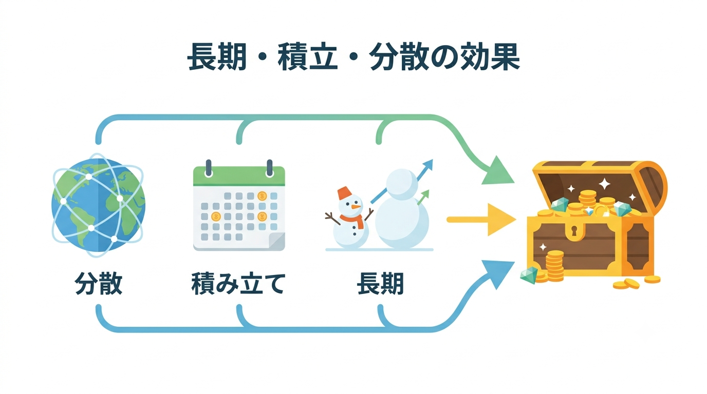
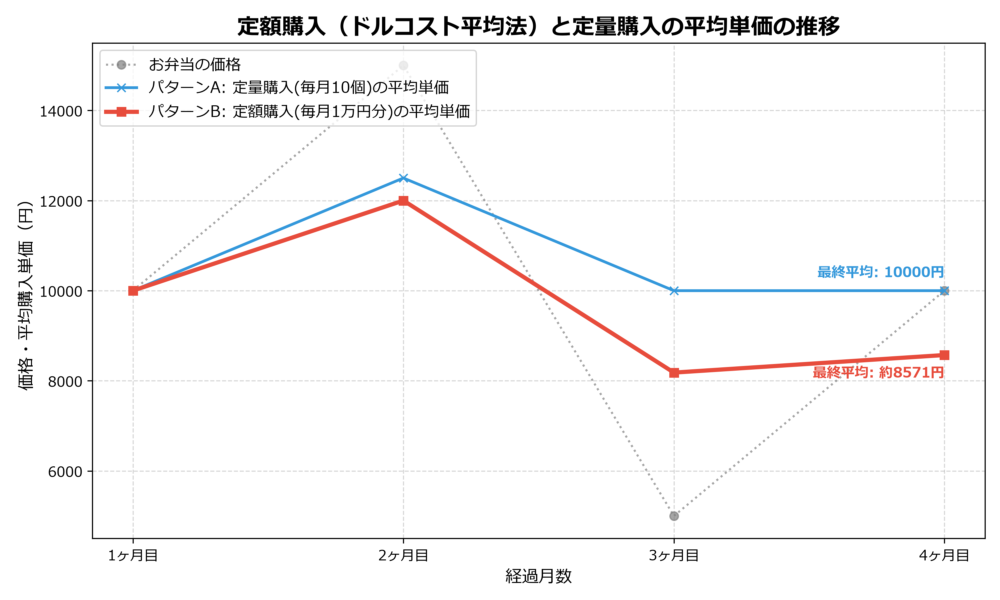

# 【図解】中学生からわかる資産運用 〜お弁当メタファーで学ぶ投資と自衛〜

## 第3回：誰でもできる王道の食べ方（長期・積立・分散）

> この記事は、**中学生から大人まで誰でも**、全4回で資産運用の基本から詐欺の見抜き方までを楽しく学ぶシリーズの第3回です。

**【目次：中学生からわかる資産運用シリーズ】**
*   [第1回：【準備編】投資って怖い？「水」と「魔法の雪だるま」の話](https://qiita.com/あなたの記事URL1)
*   [第2回：【用語編】専門用語は「お弁当」に置き換えよう！](https://qiita.com/あなたの記事URL2)
*   **▶ 現在地：第3回：【実践編】誰でもできる王道の食べ方（長期・積立・分散）**
*   [第4回：【防衛・卒業編】毒入り弁当（詐欺）の見抜き方と卒業クイズ](https://qiita.com/あなたの記事URL4) ※公開後にURLを挿入

---

## どんなお弁当を、どうやって買うのが正解なの？

前回は、小難しい金融用語をすべて **「お弁当屋さん」に置き換えて、資産運用が「食材（株・債券）」を「お弁当（投資信託）」としてまとめ、「魔法の箱（NISA・iDeCo）」に入れて買うという、シンプルな3つの階層でできている**ことをお話ししました。

もしかするとあなたは、「仕組みはわかったけど、結局どのお弁当を選んで、どうやって買っていけば一番損をしないの？」と考えているかもしれませんね。

今回は、その疑問にズバリお答えします。世界中のプロも認める「最も手堅くて、誰にでもできる最強の買い方」を伝授しましょう。この方法を知れば、もう毎日の株価の上がり下がりで一喜一憂する必要はなくなります。

## 自分の「胃袋の大きさ」を知ろう（リスク許容度）

最強の買い方をお話しする前に、一つだけやっておかなければいけないことがあります。それは「自分の胃袋の大きさ」を知ることです。

金融の世界では、よく **「リスクとリターン」** という言葉が使われます。「リターン」は得られる利益のことですが、「リスク」は「危険」という意味ではありません。金融の世界におけるリスクとは **「結果の振れ幅（ブレ）」** のことを指します。

お肉（株）たっぷりのお弁当はエネルギー（リターン）が高いですが、値段の上がり下がり（リスク）も激しいです。逆に野菜（債券）中心のお弁当は、値段は安定していますが、大きく増えることもありません。

ここで大切なのが **「リスク許容度（きょようど）」** です。これは「あなたがどれくらいのマイナス（損）までなら、夜グッスリ眠れるか」という、いわば「胃袋の大きさ」のこと。

<!-- 【図解挿入位置①：リスク許容度の対比】
左側：大盛りの焼肉弁当（株多め）をガツガツ食べている元気な若者
右側：野菜多めのヘルシー弁当（債券多め）をゆっくり食べている穏やかなお年寄り
この2つを対比させ、年齢や状況によって適正な「胃袋のサイズ」が違うことを示すポップな図解 -->

では、自分の胃袋の大きさをどうやって数字で測ればいいのでしょうか？ 投資の世界でよく言われる一般的な目安（ルール）として、 **「100－年齢の法則」** というものがあります。

*   **リスク資産（お肉＝株）の適正な割合 ＝ 100 － あなたの年齢**

例えば、あなたが20歳なら「100－20＝80」で、お弁当の80%をお肉（株）にして攻めても、もし失敗した時に働いて取り返す時間と体力があります。しかし、あなたが60歳なら「100－60＝40」となり、お肉は40%程度に抑え、残りの60%は安全な野菜や水（債券や預金）で守りを固めるべき、という考え方です。

※これはあくまで一般的な目安ですが、自分のリスク許容度を定量的に測る第一歩として非常に便利です。

自分の胃袋の大きさを無視して、無理にお肉ばかり食べようとすると、暴落が起きたときにパニックになって「もう投資なんてやめる！」と、一番もったいないタイミングで投げ出してしまうことになります。

## 最強の戦術：「幕の内弁当の定期便」（長期・積立・分散）

<!-- 【図解挿入位置②：長期・積立・分散の効果】
地球のイラスト（世界中に分散）、カレンダー（毎月積立）、右肩上がりの雪だるま（長期の複利）の3つのアイコンが合わさり、最終的に大きな宝箱に繋がるような図解 -->

自分の胃袋の大きさがわかったら、いよいよ最強の買い方の発表です。
資産運用の世界で「王道」と呼ばれる絶対に外せない3つのルールがあります。それは **「長期・積立・分散」** です。

1.  **長期**：魔法の雪だるま（複利）を大きくするために、10年、20年という時間をかけること。
2.  **分散**：一つのおかず（1つの会社の株）だけに偏らず、世界中の色々な食材をバランスよく買うこと。
3.  **積立**：毎月「決まった金額」で、コツコツとお弁当を買い続けること。

つまり、あなたにやってほしいことはたった一つ。
**「世界中の食材がバランスよく入った『定番の幕の内弁当（世界中に分散されたインデックスファンド）』を、毎月定額で届けてもらう『定期便』に設定して、あとは何十年もほったらかす」**
これだけです。

「そんな簡単な方法で本当に上手くいくの？」と思うかもしれません。
実は、この「長期・積立・分散」を徹底して大成功を収めている身近な例があります。それが、私たちの年金を運用している国家機関 **「GPIF（年金積立金管理運用独立行政法人）」** です。

GPIFは、国内と外国の「お肉（株式）」と「野菜（債券）」を25%ずつ均等に分けたお弁当を作り、長年にわたってコツコツと運用を続けています。その結果、2001年の運用開始から長年の間、なんと **「約150兆円」** もの莫大な利益（年率約4.4%のリターン）を生み出しています[^1]。プロ中のプロである国家機関が実践しているのも、結局はこの王道のやり方なのです。

## なぜ「定額で買い続ける」のが最強なのか？（ドル・コスト平均法）

「でも、毎月買うってことは、お弁当の値段が高い時にも買わなきゃいけないから、損するんじゃないの？」と思うかもしれません。

実はその逆です。**「毎月、決まった金額で買い続ける」** というシステムこそが、数学的に証明された「自動バーゲンセール」の魔法なのです。これを専門用語で **「ドル・コスト平均法」** と呼びます。

毎月「10個ずつ（定量）」買うのと、毎月「1万円分ずつ（定額）」買うのでは、何が違うのでしょうか？
少し極端ですが、お弁当の価格が「1000円→1500円→500円→1000円」と激しく上下した4ヶ月間を比較してみましょう。

<!-- 【図解挿入位置③：ドル・コスト平均法の比較グラフ】
※Pythonコードで生成した、価格推移・定量購入の平均単価・定額購入の平均単価を比較したグラフ画像を挿入 -->

*   **パターンA：毎月「10個」買う場合（定量購入）**
    高い時も安い時も関係なく10個買います。
    1万円（1000円の時）＋1.5万円（高い時）＋5千円（安い時）＋1万円＝合計4万円で「40個」のお弁当が買えました。1個あたりの平均購入単価は **1,000円** です。
*   **パターンB：毎月「1万円分」買う場合（定額購入＝ドルコスト平均法）**
    10個（1000円の時）＋約6.6個（高い時）＋**20個（安い時！）**＋10個＝合計4万円で、なんと「約46.6個」のお弁当が買えました！1個あたりの平均購入単価は **約858円** までガクッと下がります！。

同じ4万円を使ったのに、定額購入（パターンB）の方がたくさんのお弁当を買えています。
これは、「毎月1万円分買う」と決めておくだけで、**システムが勝手に「価格が高い時は少なく買い、価格が安い時には大量に買いだめしてくれる」メカニズム** が働くからです。

これを数学の世界では「調和平均（ちょうわへいきん）」と呼びます。計算式で書くとこうなります。

$$
\text{調和平均（平均購入単価）} = \frac{N（購入回数）}{\sum_{i=1}^{N} \frac{1}{P_i（その時の価格）}}
$$

数式は難しく見えますが、要するに「安い時の価格」が全体の平均単価を強烈に引き下げるようにできているのです。先ほどの例で言えば、1個あたりの平均購入単価は **約858円** までガクッと下がります。

価格が激しく上下しても、安い時に大量に仕込める「定額購入」の方が、結果的に平均購入単価を安く抑えることができます。これが、損をしにくくなる数学的なカラクリです。

## 最後に：たまには「お弁当の中身」を整えよう（リバランス）

最後に一つだけ、メンテナンスのお話をします。
幕の内弁当の定期便を何年も続けていると、中に入っているお肉（株）と野菜（債券）のバランスが崩れてくることがあります。

たとえば、「お肉50％、野菜50％」の理想のバランスでスタートしたのに、何年か経って「最近お肉（株）の値段がすごく上がったから、お弁当全体のお肉の割合が70％になっちゃった！」ということが起こります。
このまま放置すると、あなたの「胃袋（リスク許容度）」の限界を超えて、胃もたれしてしまうかもしれません。

<!-- 【図解挿入位置③：リバランスの図解】
「肉70%・野菜30%」に崩れてしまったお弁当を、はみ出た肉を売って野菜を買い足し、「肉50%・野菜50%」の綺麗なバランスに戻すビジュアル -->

そこで、増えすぎたお肉を少し売って、そのお金で減ってしまった野菜を買い足し、元の「お肉50％、野菜50％」に戻す作業をします。これを **「リバランス（配分調整）」** と呼びます。実際には、歴史的に見ても株（お肉）の方がよく成長するため、この「増えすぎたお肉を売って野菜を買う」パターンがほとんどです。

「じゃあ、その逆は起こらないの？」と思うかもしれません。
確かに頻度は低いですが、**本当にリバランスの威力が発揮されるのは、まさに「その逆」が起きたときです。**

歴史的な大暴落（リーマン・ショックやコロナ・ショックなど）が起きてお肉の値段が急落し、相対的に野菜の割合が大きくなってしまったとき。このときは、安全な野菜を少し売り、大バーゲンセール状態になったお肉を「買い増す」ことになります。

リバランスは、「値段が上がっているものを利益が出ているうちに売り、値段が下がっているものを安いうちに買う」という、**投資の鉄則を自動的にやってのける優れたメンテナンス術です**。1年に1回くらい、自分のお弁当のバランスをチェックするだけで十分です。

## まとめ：設定したら、あとは自分の人生を楽しもう！

**自分の胃袋（リスク許容度）に合わせて、世界中に分散された「幕の内弁当」を選び、毎月定額で買う「定期便（積立）」に設定する。そして、たまにバランスを整える（リバランス）** 。

これが **資産運用の王道** です。この仕組みさえ作ってしまえば、あなたは毎日スマホで株価のニュースをにらみつけて、ハラハラする必要は一切ありません。設定を済ませたら、あとは「時間」と「複利の雪だるま」に任せて、趣味や大切な人との時間など、あなたの「本当の人生」を楽しんでください。

さて、いよいよ次回は最終回。
世の中には、この王道ルールから外れた「絶対に食べてはいけない毒入り弁当（詐欺）」がたくさん転がっています。次回は、その見抜き方を伝授し、最後に「卒業クイズ」を用意しています。お楽しみに！

---

*   ▶ [第4回：【防衛・卒業編】毒入り弁当（詐欺）の見抜き方と卒業クイズへ進む](#)
*   ▶ [今すぐゲームでシミュレーションしてみる！（遊んでわかる資産運用！）](#)

> **【免責事項】**
> 本記事およびゲームのシミュレーションは、実践的な金融経済知識の普及啓発と学習を目的として作成したものであり、特定の金融商品の売買の勧誘を目的としたものではありません。実際の資産運用や投資に当たっては、必ずご自身の責任において最終的に判断してください。

## 参考文献
[^1]: 頼藤 太希 (2025) 「GPIF（年金積立金管理運用独立行政法人）が実践、『年利4.4％』で堅実にお金を増やす資産配分の考え方」『マネクリ（マネックス証券の投資情報メディア）』, https://media.monex.co.jp/articles/-/22901 (アクセス日: 2026年6月16日).