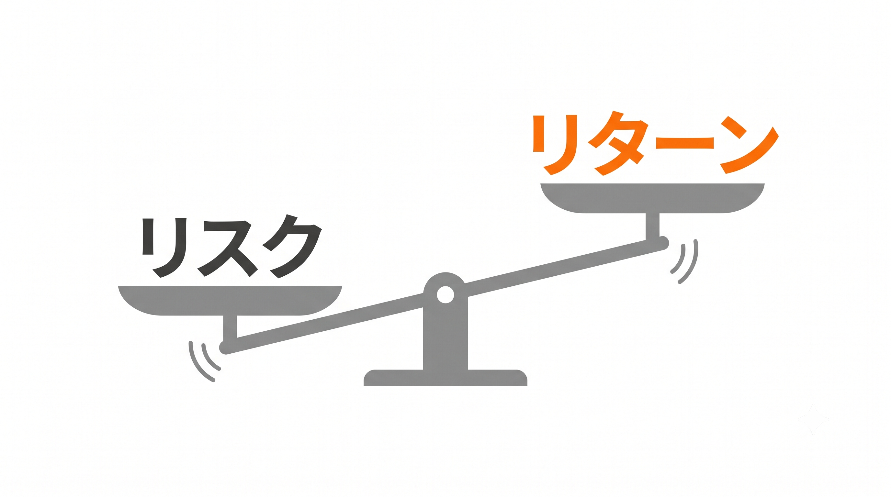

# 【図解】中学生からわかる資産運用 〜お弁当メタファーで学ぶ投資と自衛〜

## 第4回：【防衛・卒業編】毒入り弁当（詐欺）の見抜き方と卒業クイズ

> この記事は、**中学生から大人まで誰でも**、全4回で資産運用の基本から詐欺の見抜き方までを楽しく学ぶシリーズの最終回です。

**【目次：中学生からわかる資産運用シリーズ】**
*   [第1回：【準備編】投資って怖い？「水」と「魔法の雪だるま」の話](https://qiita.com/あなたの記事URL1)
*   [第2回：【用語編】専門用語は「お弁当」に置き換えよう！](https://qiita.com/あなたの記事URL2)
*   [第3回：【実践編】誰でもできる王道の食べ方（長期・積立・分散）](https://qiita.com/あなたの記事URL3)
*   **▶ 現在地：第4回：【防衛・卒業編】毒入り弁当（詐欺）の見抜き方と卒業クイズ**

---

## 投資の「絶対の物理法則」を知っていますか？

もしかするとあなたは、ここまで読んで「よし、王道のやり方はわかった。でも、世の中にはもっと簡単に、絶対に損をせずに大きく儲かる裏ワザがあるんじゃないの？」と思っているかもしれません。

最初に結論から言います。**そんな裏ワザはこの世に存在しません。** もし誰かがそんな話を持ってきたら、それは100%あなたを騙そうとしている詐欺師です。

今回は、あなたが一生涯、絶対に詐欺に引っかからないための「最強の防衛力」を授けます。難しい法律を覚える必要はありません。**たった一つの「絶対の物理法則」**を覚えておくだけでいいのです。

## ローリスク・ハイリターンは存在しない（トレードオフ）

第2回で、金融の世界には「お肉（株＝ハイリスク・ハイリターン）」と「野菜（債券＝ローリスク・ローリターン）」という2つの食材があるとお話ししました。

これを日常の食事に置き換えて考えてみてください。

「食べれば食べるほど筋肉がムキムキになってエネルギーが湧き上がってくるのに、カロリーはゼロで絶対に太らない魔法の超ヘルシー肉」なんて、現実の世界にあるでしょうか？ ありませんよね。

金融の世界もまったく同じです。**「リスク（振れ幅・危険性）」と「リターン（収益）」は、常に等価交換です。** この法則を、専門用語で **「トレードオフ」** と呼びます。

大きなリターン（お肉）を得たければ、必ず大きなリスク（胃もたれ）を引き受けなければなりません。逆に、リスクをゼロ（水や野菜）にしたければ、得られるリターンもほぼゼロになります。
このトレードオフの法則は、重力と同じくらい絶対的なものです。この法則を無視した「ローリスク・ハイリターン」な金融商品は、物理的に作ることができないのです。

## これが出たら100%「毒入り弁当」！詐欺師のキラーワード

このトレードオフの法則を知っているだけで、世の中の詐欺の多くは一瞬で見抜くことができます。詐欺師がよく使う「魔法の言葉」を見てみましょう。

*   **キラーワード①：「元本保証（絶対に損しません）で、毎月3%の配当（高いリターン）がもらえます！」**
    「絶対に損しない（リスクゼロ）」と言いながら「高いリターン」を約束しています。これはトレードオフの物理法則を完全に無視した、あり得ない商品です。
*   **キラーワード②：「上場間近で確実に何倍にも値上がりする、あなただけの未公開株です！」**
    「確実に（リスクゼロ）」と言いながら「何倍にもなる（ハイリターン）」と主張している時点で、法則に反しています。さらに言えば、**本当に確実に何倍にもなるなら、銀行からお金を借りて自分で独り占めして買えばいいはずです。** わざわざ見ず知らずのあなたに勧めてくる時点で、論理が完全に破綻しています。

金融庁や日本証券業協会も再三にわたって注意喚起を行っていますが[^1],[^2]、**「元本保証で高利回り」という言葉が出た瞬間に、それはあなたが100%腹を壊す「毒入り弁当」だと断言できます。**

詐欺師は、あなたの「お金を増やしたい」という欲求と「損をしたくない」という不安を巧みに突いてきます。しかし、「正しい知識」という防衛力を持った今のあなたなら、もう毒入り弁当を買わされることは絶対にありません。

👇 万が一、詐欺や金融トラブルに巻き込まれたら？（クリックで開きます）

どんなに気をつけていても、「お金を振り込んでしまった」「連絡が取れなくなった」といったトラブルに巻き込まれる可能性はゼロではありません。もし「おかしいな？」と思ったら、**絶対に追加のお金を振り込まず、一人で悩まずに以下の公的機関にすぐ相談してください。**

*   [消費者ホットライン（局番なしの 188）](https://www.caa.go.jp/policies/policy/local_cooperation/local_consumer_administration/hotline/)
    「いやや（188）」と覚えてください。身近な消費生活センターを案内してくれます。
*   [警察相談専用電話（#9110）](https://www.gov-online.go.jp/article/201309/entry-7508.html)
    明らかな詐欺や犯罪行為の疑いがある場合は、迷わずこちらへ。
*   [証券・金融商品あっせん相談センター（FINMAC：0120-64-5005）](https://www.finmac.or.jp)
    株式や投資信託などの金融商品トラブルに関する中立な相談窓口です。
*   [「株や社債をかたった投資詐欺」被害防止コールセンター（0120-344-999）](https://www.jsda.or.jp/about/hatten/inv_alerts/toushisagi/index.html)
    怪しい未公開株や投資の勧誘を受けた際の情報提供・相談窓口です。

投資は、あなたが確実にコントロールできる口座（自分名義の銀行や証券会社のNISA・iDeCo口座）の範囲内でのみ行うのが絶対のルールです。

## 卒業クイズ：あなたの防衛力をテストしよう！

さあ、全4回のおさらいとなる「卒業クイズ（全10問）」です！
これまで順番にブログを読んでくれたあなたなら、きっと全問正解できるはずです。

👉 Q1. 投資を始める前に、一番最初に確保すべき「絶対に使ってはいけない水」とは何でしょう？（クリックで正解を表示）

**正解は「生活防衛資金（数ヶ月〜半年分の預金）」です！**
投資は余剰資金で行うのが絶対ルールです。急な病気や出費に備えた防御力が一番大切です。（第1回より）

👉 Q2. アインシュタインが「人類最大の発見」と呼んだ、利益が利益を生む魔法の仕組みは？（クリックで正解を表示）

**正解は「複利」です！**
利益を引き出さずに再投資することで、雪山を転がる雪だるまのように資産が大きくなっていきます。（第1回より）

👉 Q3. 投資の世界の「お肉（高いエネルギーだが胃もたれする）」に例えられる金融商品は何でしょう？（クリックで正解を表示）

**正解は「株式」です！**
ハイリターンが期待できますが、価格の振れ幅（リスク）も大きいため、野菜（債券）とバランスよく食べることが大切です。（第2回より）

👉 Q4. 「特製・焼肉弁当（アクティブファンド）」が「定番の幕の内弁当（インデックスファンド）」に長期的に勝てない最大の理由は何でしょう？（クリックで正解を表示）

**正解は「高い『調理代（信託報酬）』が毎年かかり続けるから」です！**
プロの手間暇がかかっている分コストが高く、長期投資においてはこのコストがリターンを削る最大の要因になります。（第2回より）

👉 Q5. おかずを税金につまみ食いされないための「魔法のお弁当箱（制度）」のうち、いつでも引き出せる使い勝手の良い箱の名前は？（クリックで正解を表示）

**正解は「NISA（ニーサ）」です！**
老後資金専用で60歳まで引き出せないタイムカプセルは「iDeCo（イデコ）」でしたね。（第2回より）

👉 Q6. 金融の世界における「リスク」の本当の意味とは何でしょう？（クリックで正解を表示）

**正解は「結果の振れ幅（ブレ）」です！**
リスク＝危険ではありません。どれくらいのマイナスまでなら夜グッスリ眠れるかという「リスク許容度（胃袋の大きさ）」を知ることが重要です。（第3回より）

👉 Q7. GPIF（国の年金運用機関）も実践している、資産運用の「王道の買い方」である3つのルールとは？（クリックで正解を表示）

**正解は「長期・積立・分散」です！**
世界中の食材が入ったお弁当を、毎月定額で、何十年も買い続ける最強の戦術です。（第3回より）

👉 Q8. 毎月「決まった金額」を買い続けることで、安い時に自動的にたくさん買いだめできる数学的な仕組みを何と呼ぶ？（クリックで正解を表示）

**正解は「ドル・コスト平均法」です！**
価格が激しく上下しても、平均購入単価を安く抑えることができる自動バーゲンセール機能です。（第3回より）

👉 Q9. 時間が経って崩れてしまったお肉と野菜のバランスを元の比率に戻すメンテナンス作業を何と呼ぶ？（クリックで正解を表示）

**正解は「リバランス」です！**
これを年に1回行うことで、大暴落が起きた時でも感情に振り回されず「安い時に株を仕込む」ことができます。（第3回より）

👉 Q10. 知人から「元本保証で毎月3%の配当がもらえる絶対安全な未公開株」に誘われました。あなたはどうする？（クリックで正解を表示）

**正解は「毒入り弁当（詐欺）確定なので、絶対に買わず距離を置く」です！**
「元本保証」と「高いリターン」が両立することはありません（トレードオフの法則）。どんなに親しい人からの誘いでもきっぱり断りましょう。（第4回より）

全問正解できましたか？
素晴らしいです！ これであなたは、世の中の大多数の人が知らない「資産運用の正しい地図」を手に入れました。あなたはもう、上位数%の金融リテラシー保持者です！

## 結び：「見えないコスト」との折り合いをつけよう

最後に、一番大切なメッセージをお伝えしてこの連載を終わります。

資産運用を始めると、最初は楽しくて、毎日スマホを開いて株価の上がり下がりをチェックしてしまうかもしれません。「今日は1,000円増えた！」「明日は下がるかな？」と気になって、仕事や勉強が手につかなくなる人もいます。

でも、**あなたの人生は、お金の数字を眺めるためにあるのではありません。**

毎日株価をチェックして一喜一憂することは、あなたの貴重な「時間」と「集中力」という、とても大きな **「見えないコスト」** を浪費していることになります。

私たちが第3回で学んだ王道の買い方（幕の内弁当の定期便）は、**「ほったらかし」ができるからこそ最強** なのです。

自分の胃袋（リスク許容度）に合った積立設定を済ませたら、スマホの画面はそっと閉じましょう。そして、自動で働くシステムと「複利の魔法」にお金を育てる作業はすべて任せてください。
あなたが本当にやるべきことは、空いた時間で美味しいものを食べ、趣味に没頭し、大切な人たちと笑い合うことです。

資産運用は、あなたの人生を縛るものではなく、**あなたの人生を自由にするためのツール** です。そのことだけは、絶対に忘れないでくださいね。

長くなりましたが、最後までお付き合いいただき本当にありがとうございました。
さあ、知識は十分に身につきました。次は、今回学んだことを実際のゲームで「体感」してみましょう。あなたがゲームの中でどれだけ資産を育てられるか、楽しみにしています！

---

*   ▶ [今すぐゲームでシミュレーションしてみる！（遊んでわかる資産運用！）](#)

> **【免責事項】**
> 本記事およびゲームのシミュレーションは、実践的な金融経済知識の普及啓発と学習を目的として作成したものであり、特定の金融商品の売買の勧誘を目的としたものではありません。実際の資産運用や投資に当たっては、必ずご自身の責任において最終的に判断してください。

## 参考文献
[^1]: 金融庁 (2025)「詐欺的な投資勧誘等にご注意ください！」『金融庁』,https://www.fsa.go.jp/ordinary/chuui/attention.html (アクセス日: 2026年6月16日).
[^2]: 日本証券業協会(2023)「トラブルにあった場合はどこに相談すればいいの？」『日本証券業協会』, https://www.jsda.or.jp/about/hatten/inv_alerts/alearts02/index.html (アクセス日: 2026年6月16日).